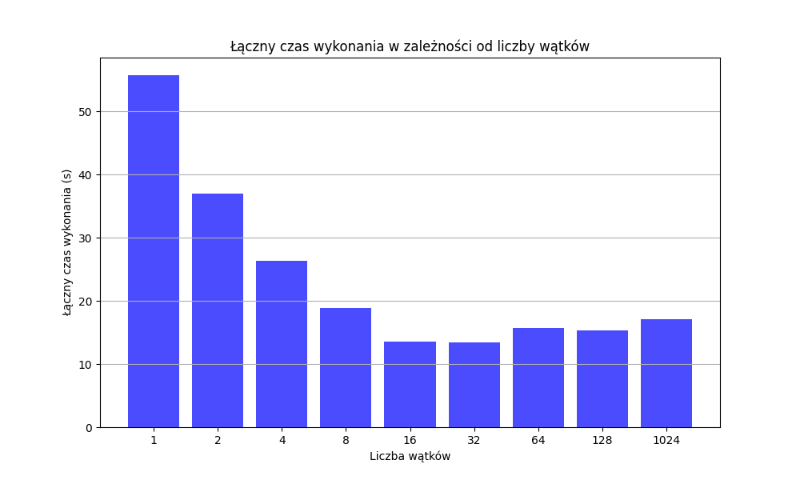
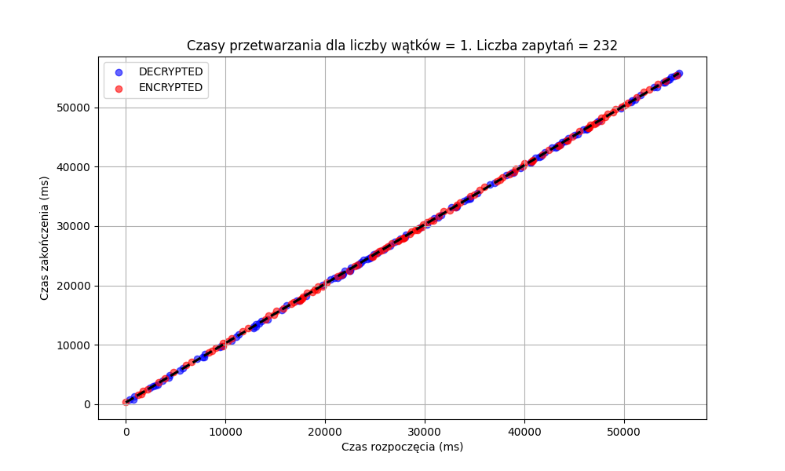
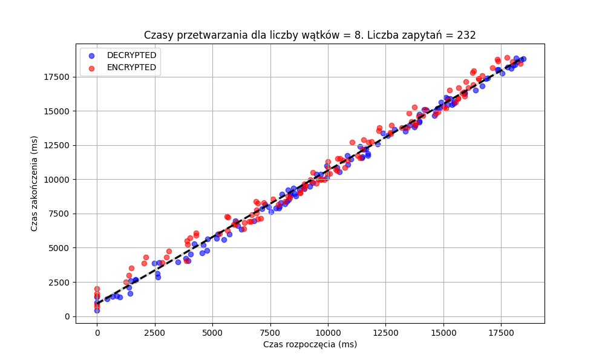
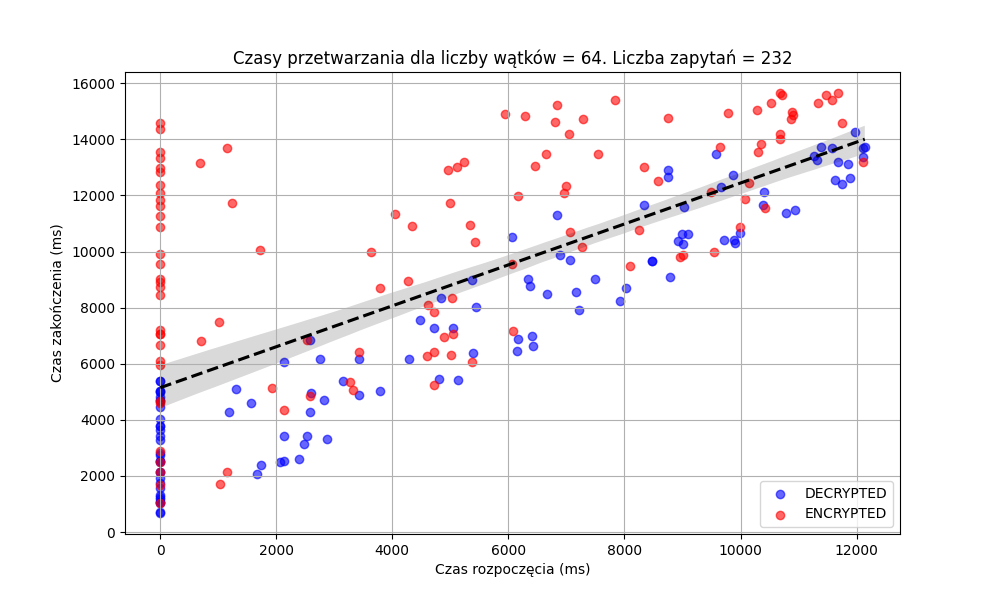
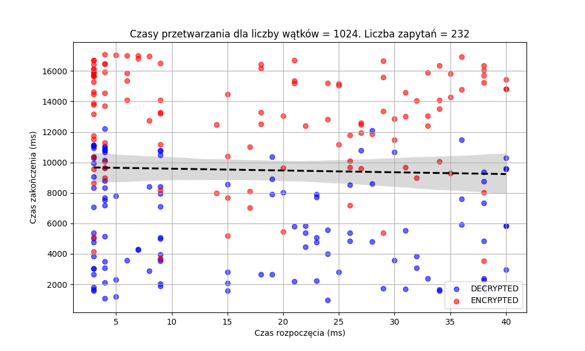

# Analiza Efektywności Wielowątkowości

## 1. Wprowadzenie
Celem sprawozdania jest przedstawienie różnicy w wydajności aplikacji wielowątkowych w zależności od liczby rdzeni procesora.
Porównane zostaną czasy wykonania algorytmu szyfrowania AES dla 232 plików zawierających dużą ilość danych.

W celu uzyskania dokładniejszego porównania czasu pliki są szyfrowane fragmentami 50-bajtowymi, co wymaga wielokrotnego odczytu z pliku.
Każdy wątek wykonuje operacje szyfrowania lub deszyfrowania na przydzielonym fragmencie danych.
Wykorzystana kolejka blokująca pozwala na synchronizację przetwarzania.
Kolejka ta jest używana w środowisku wielowątkowym, w którym jedne wątki produkuje dane, a inne je konsumują.

---

## 2. Wykresy przedstawiający czasy wykonania

    
    
    
    

---

## 3. Opisy wykresów 
Analizując wykres, można zauważyć, że czas wykonania algorytmu AES w przypadku użycia tylko jednego wątku jest
znacząco dłuższy niż w przypadku zastosowania wielowątkowości.
Czas ten jednak nie zmniejsza się proporcjonalnie wraz ze wzrostem liczby wątków. Największą poprawę
wydajności osiągnięto przy użyciu około **16 wątków**, gdzie czas wykonania został zmniejszony około **4-krotnie**
w porównaniu z przetwarzaniem sekwencyjnym.

Dla testów z większą liczbą wątków nie zaobserwowano dalszej znaczącej poprawy czasu wykonania. Wręcz przeciwnie – przy dużej liczbie wątków czas ma tendencję do nieznacznego wzrostu. Wynika to z:
- ograniczeń liczby dostępnych rdzeni procesora,
- niewykorzystania wszystkich wątków przez system,
- narzutu związanego z zarządzaniem wieloma wątkami ich tworzeniem i synchronizacją,
- liczby plików do przetworzenia – każdy plik przypisywany jest do jednego wątku.

Z czterech mniejszych wykresów możemy zauważyć, że czas rozpoczęcia przetwarzania plików znacząco się zmienił.
W sekwencyjnym przetwarzaniu pliki były przetwarzane po kolei, więc po skończeniu przetwarzania jednego pliku, zaczynał
być przetwarzany kolejny. Natomiast dla 1024 wątków wszystkie pliki prawie od razu zostały przydzielone do któregoś z wątków.
Widzimy tu również ogromny wpływ planisty systemu operacyjnego, który przydziela wątki do rdzeni procesora według 
jednego z wielu algorytmów, powodując, że niektóre wątki będą często wstrzymywane, co wydłużaja czas przetwarzania.
Prosta regresyjna dobrze pokazuje, że dane były przetwarzane coraz bardziej równolegle, niż sekwencyjnie.

---

## 4. Wnioski
Na podstawie analizy można wyciągnąć następujące wnioski:
1. Wielowątkowość znacząco poprawia wydajność przetwarzania, jednak efekt nie jest liniowy w stosunku do liczby wątków.
2. Największe korzyści wydajnościowe osiągnięto przy około 16 wątkach – dalsze zwiększanie ich liczby nie przynosi już istotnych zysków.
3. Skalowalność przetwarzania ograniczona jest przez liczbę dostępnych rdzeni oraz działań na plikach.
4. Należy odpowiednio dobierać liczbę wątków w zależności od zasobów sprzętowych i charakterystyki problemu.
5. Zastosowanie kolejki jako struktury danych nie jest optymalne ze względu na konieczność blokowania wątków,
chociaż i tak daje całkiem dobre rezultaty. Program można byłoby przyspieszyć, używając ExecutorsService.newFixedThreadPool() 
oraz wrzucając do niego zadania bezpośrednio podczas wczytywania danych. ExecutorsService sprawi, że tylko
N wątków będzie działać jednocześnie i jak wątek zakończy swoje działanie, to zaczyna wchodzić kolejny oczekujący.
Działałoby to, jak kolejka, lecz bez potrzeby blokowania wątków do odczytu danych z niej.
---

## 5. Podsumowanie
Wielowątkowość pozwala na znaczne przyspieszenie operacji przetwarzania wielu plików naraz, w tym przypadku: szyfrowania AES, 
ale jej efektywność zależy od liczby dostępnych rdzeni oraz narzutu związanego z zarządzaniem wątkami.
Odpowiednia strategia podziału pracy i alokacji zasobów pozwala na optymalne wykorzystanie dostępnych zasobów sprzętowych.

